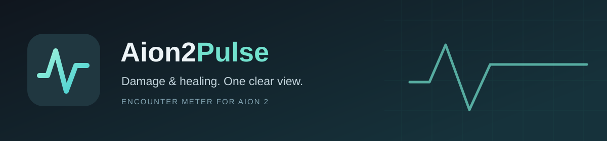
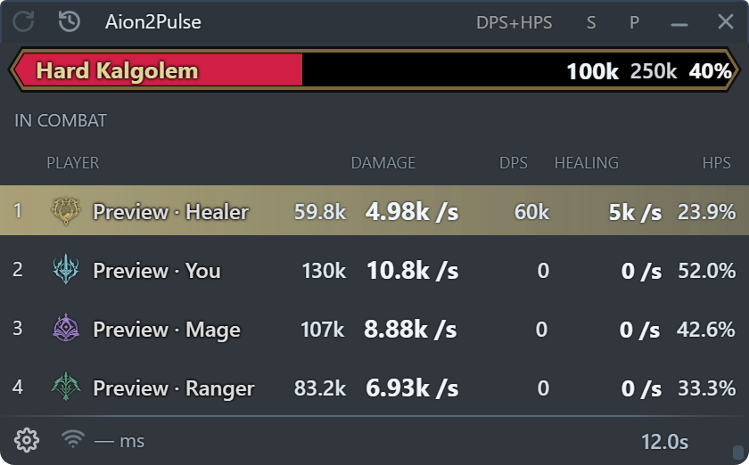
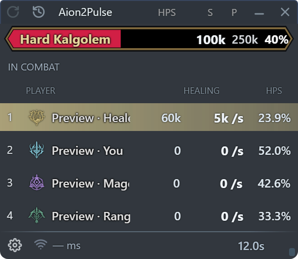
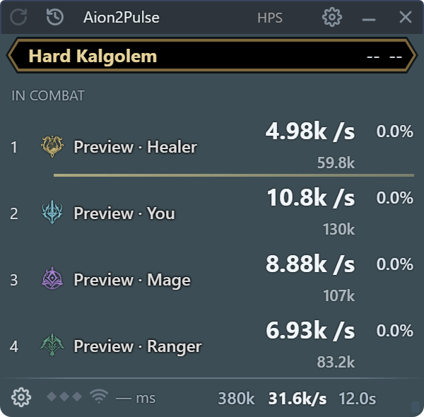
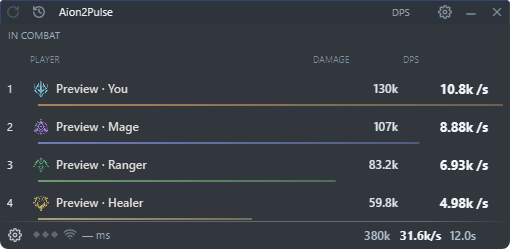
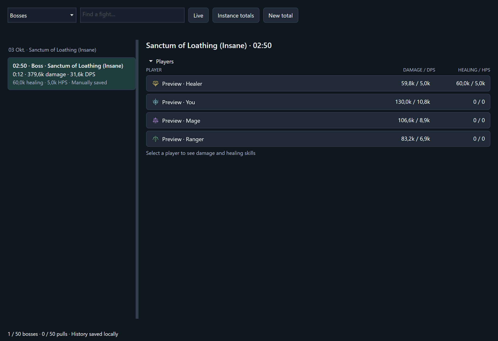
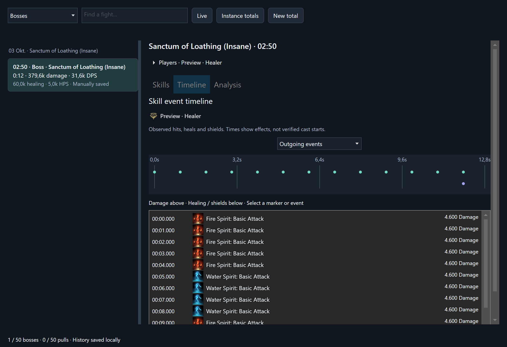
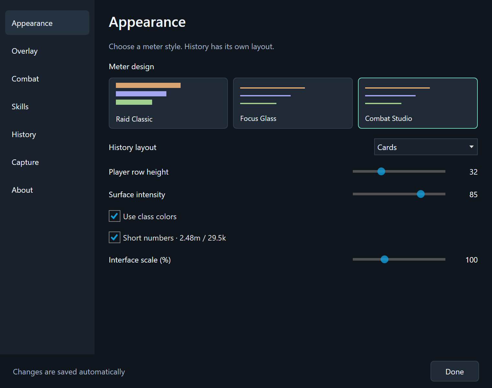
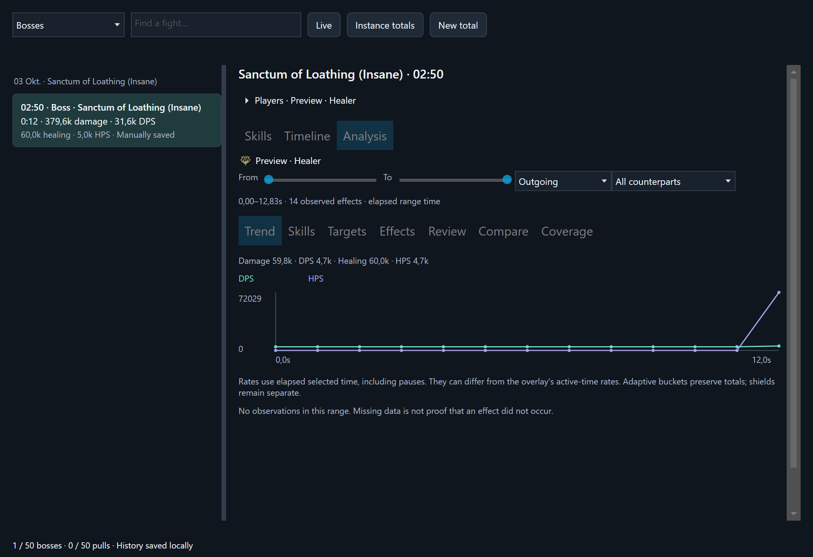

<p align="center">
  
</p>

> **0.4.0-preview.3 — experimental preview.** Compact overlays, configurable
> pull grouping, contextual hover help and expanded encounter analysis are available on this
> branch. These changes are not included in the published 0.3.3 release. See the
> [packet analysis roadmap](docs/packet-analysis-roadmap.md) for evidence limits.


<p align="center">
  <strong>A DPS and healing meter for AION 2.</strong><br>
  Automatic encounters, compact overlays and the details behind every fight.
</p>

<p align="center">
  <a href="https://github.com/Steiner2/Aion2Pulse/releases/latest"><strong>Download for Windows</strong></a>
  &nbsp; · &nbsp;
  <a href="https://github.com/Steiner2/Aion2Pulse/issues">Report an issue</a>
  &nbsp; · &nbsp;
  <a href="#build-from-source">Build from source</a>
</p>

<p align="center">Windows x64 &nbsp; · &nbsp; .NET 10 &nbsp; · &nbsp; GPL-3.0</p>

<p align="center">
  
  <br><sub>Actual application UI. All screenshots use synthetic players and combat data.</sub>
</p>

## Every fight, clearly

| Damage and healing | Encounters that stay readable | Details when you need them |
| --- | --- | --- |
| Switch between DPS, HPS or both. Total damage and healing remain visible beside their rates. | Finished results stay frozen. New pulls start fresh, while known boss intermissions stay in one encounter. | Explore player totals, original skill icons, saved fights and overall totals for the current map visit. |

## Choose your overlay

| Raid Classic | Focus Glass | Combat Studio |
| :---: | :---: | :---: |
|  |  |  |
| Familiar class bars. | A compact, open layout. | A compact layout with subtle separators. |

All three designs support interface scaling, class colors, adjustable transparency
and the combined damage/DPS/healing/HPS view. **DPS remains the default.**

## A history worth keeping



Retain the last 50 boss fights and 50 normal pulls independently. New mob pulls
cannot evict saved bosses. History opens on bosses; filters also show all fights,
normal pulls or incomplete encounters. Select a player for skill details and a
timeline of packet-observed hits, heals and shields, including original skill
icons and timestamps. These effect timestamps are not guaranteed cast-start times.
Choose a split view with an adjustable divider, compact list or card layout.
Overall totals cover the current map visit and exclude travel and waiting time.

<details>
<summary><strong>See the skill event timeline</strong></summary>



</details>

The overlay uses a compact automatic width. Drag its bottom-right grip while
interactive or choose a saved width under **Settings → Overlay**. Combined DPS/HPS
keeps a wider minimum for four readable numerical columns.

<details>
<summary><strong>See the settings window</strong></summary>



Appearance, overlay behavior, combat timing and history options are organized in
a separate window. Changes are saved automatically.

</details>

## Get started

1. Download **Aion2Pulse-win-x64.zip** from [Releases](https://github.com/Steiner2/Aion2Pulse/releases/latest).
2. Extract the complete archive and launch **Aion2Pulse.exe** as administrator.
3. Start the meter before entering the game. If your character is not recognized,
   return to character selection and enter again.

The Windows package includes the .NET runtime and WinDivert. Npcap is not required.
Keep the `history/` folder next to the application when updating.

## Tracking and encounter analysis

Choose **Settings → Combat → Tracking behavior**:

| Mode | Behavior |
| --- | --- |
| Separate pulls (default) | Each completed pull gets its own result. Normal-mob inactivity defaults to five seconds. |
| Combat chain | Keep nearby normal-mob packs together until the selected break, 30 seconds by default (5–180 seconds). A known boss ending still closes the chain. |
| Manual reset | Collect across packs and long breaks until Reset or a map transition. |

All three modes apply to **All enemies** collection. The legacy boss-only scope
uses boss encounter boundaries. Changing tracking or timing starts a fresh result.
The title shortcuts cycle the display metric, design (**S**) and tracking
(**P** pulls / **C** chain / **M** manual). Reset and history remain alongside them.
Settings stay on the bottom gear; the footer contains connection status and time.
Appearance sliders update scale, row height and surface intensity immediately.

Select a player in history, then open **Analysis**. Its selectable time range
covers DPS/HPS trends, skill modifiers, direct/periodic damage, shields, targets,
observed buff windows, cooldown/charge state, resources, HP snapshots, incoming
incident review and comparable boss attempts. Graph rates use elapsed range time;
the overlay can use its active damage clock. Missing observations stay unknown.

Hover settings, shortcuts, tabs or graph points for explanations. Filter combat
metrics by known boss, other enemy, player or unknown counterpart. Skills include
DoT/HoT and delivery shares; Targets includes an observed change timeline.
Effects aligns buff/debuff windows and cooldown projections with DPS/HPS. Review
separates incoming totals from the incident window, and boss comparisons show both
DPS and HPS. The latency tooltip shows sample age and stale/unknown evidence.
**Settings → Skills** configures buff/cooldown icons and the independent monitor
scale.
New version-2 archives retain compact support observations; older version-1
archives still load without inventing missing historical state.



## Combat timing

By default, rate time follows positive group damage. Short intervals between hits
count; gaps longer than three seconds do not. This keeps rates stable during long
damage pauses while preserving the original timestamps for history and details.

Pause exclusion is an activity heuristic, not verified detection of cutscenes or
invulnerability. Deliberate inactivity and slow attacks can also be excluded.
Adjust the threshold or disable it under **Settings → Combat**. Changing the
timing option starts a fresh encounter.

Healing represents packet-reported amounts, not verified effective healing or
overheal. Latency refreshes every five seconds; the tooltip identifies a passive
TCP estimate and unknown values show **— ms**.

## Build from source

Install the .NET 10 SDK on Windows:

```powershell
./build.ps1 -Test -Publish
```

Source and synthetic regression tests are in `meter/`. Packages are generated
under `artifacts/`. Raw gameplay captures are not distributed.

## Development status

Global support is under active development. Party/force tracking, boss phases,
same-target re-pulls, healing and latency still require further live validation
against the current client.

## License and credits

Aion2Pulse is distributed under [GPL-3.0](LICENSE.txt) and is based on
[Aion2Flow](https://github.com/cloris-chan/Aion2Flow) by Cloris and contributors.
See [source provenance](meter/UPSTREAM.md) for the imported revision.

Original game icons and their catalog come from the Aion2Flow foundation.
Game asset rights remain with their respective owners and are independent of
the source-code license.
